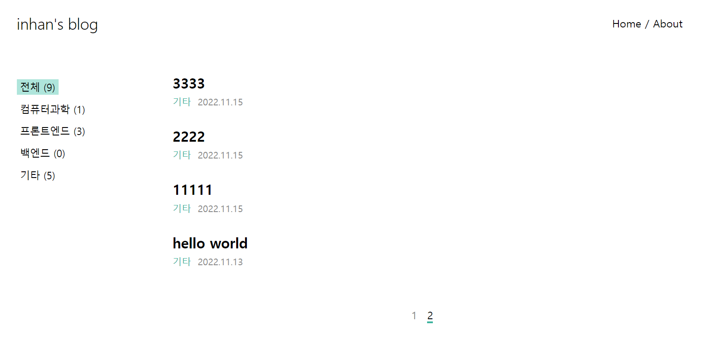

# Github Pages 정적 블로그 생성기

바닐라 자바스크립트와 타입스크립트로 개발한 Github Pages 정적 블로그 생성기 입니다
<br/>
블로그 [https://inhaan.github.io/blog-project/](https://inhaan.github.io/blog-project/)



<br/>

## Usage

### 블로그 호스팅

1. `Github Pages` 에서 `docs` 폴더를 호스팅 폴더로 선택합니다
2. `npm run build` 를 실행하면 `docs` 폴더에 정적 파일이 생성되며 푸시하면 Github Pages 사이트에 블로그가 나타납니다

### 글 작성하기

1. `npm start` 를 실행하여 로컬에서 블로그를 띄우면 글을 작성할 수 있는 버튼이 추가로 나타납니다 (수정, 삭제도 가능합니다)
2. 글을 작성하여 저장하면 `posts` 폴더에 `json` 형태로 저장됩니다
3. 빌드를 하고 푸시하면 적용됩니다

### 화면 꾸미기

1. html을 수정하려면 `template` 폴더에 있는 `mustache` 파일을 수정하면 됩니다
2. css는 `src/client/css` 폴더에 있는 파일을 수정하면 됩니다

### 메뉴 관리 등 설정

1. `app.config.json` 에서 메뉴 관리 등의 설정을 할 수 있습니다

 <br/>
 <br/>

## How to work

### 글 관리

모든 글은 `posts` 폴더에 `json` 파일로 저장되며 `md` / `html` 두 가지 형태로 저장됩니다. 업로드한 이미지는 해당 글 폴더의 `img` 폴더에 생성됩니다

### 보기좋은 url

보기좋은 url을 위해 적절하게 폴더가 구성되어 있습니다. 글의 id는 타이틀을 url에 맞게 `slugify` 하여 생성합니다

```
ex) 프론트엔드 개발자 로드맵 게시글 url
https://inhaan.github.io/blog-project/front/2211/프론트엔드-개발자-로드맵
```

### 카테고리 (메뉴)

`app.config.json` 에서 카테고리(메뉴)를 등록하고 빌드하면 그에 맞게 화면이 생성되며 글 작성시 등록된 카테고리를 선택할 수 있습니다

### 페이징

빌드시 `app.config.json` 에 설정된 페이징 크기에 따라 알아서 페이징된 화면이 생성됩니다. 각 메뉴별로 페이징이 됩니다

<br/>
<br/>
 
## Used Tools

-   `Javascript`, `Typescript`
-   `Webpack`
-   `Toast UI Editor`
-   `Node.js`, `Express`
-   `Mustache`
